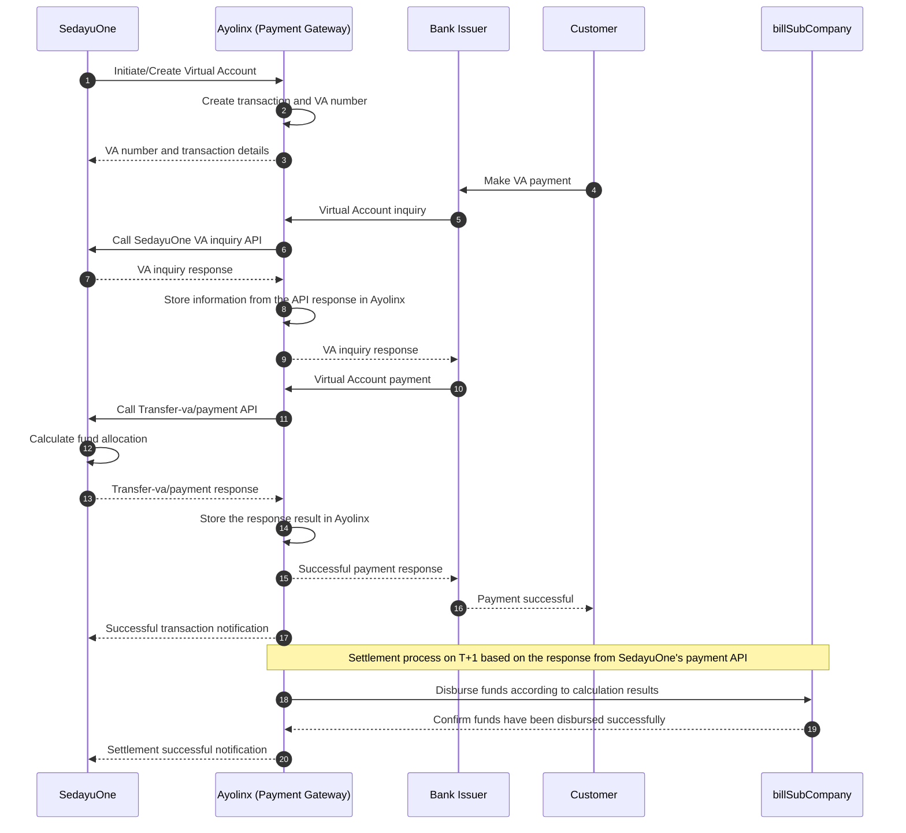

# Virtual Account Payment and Settlement Sequence Diagram

## Actors

1. **Bank Issuer** - the bank used by the Consumer to pay the Virtual Account.
2. **Ayolinx** - the Payment Gateway and Virtual Account transaction manager.
3. **SedayuOne** - the system that initiates the Virtual Account and calculates the settlement split.
4. **Customer** - the customer making the Virtual Account payment.
5. **billSubCompany** - the destination account for disbursement of settlement funds.

## Diagram

## Process Flow

1. SedayuOne initiates the creation of a Virtual Account to Ayolinx.
2. Ayolinx creates the transaction and Virtual Account number based on SedayuOne's request.
3. The Customer makes a Virtual Account payment through the Bank Issuer.
4. The Bank Issuer sends an inquiry to Ayolinx to validate the Virtual Account and retrieve billing information.
5. Ayolinx forwards the inquiry to the SedayuOne VA inquiry API to obtain confirmation and VA details.
6. Ayolinx stores the information from the inquiry API response in Ayolinx.
7. The Bank Issuer forwards the payment to Ayolinx. Ayolinx then calls the SedayuOne Transfer-va/payment API.
8. Ayolinx stores the response result from the Transfer-va/payment API in Ayolinx.
9. Ayolinx sends a successful payment response to the Bank Issuer. The Customer receives a payment success confirmation and SedayuOne receives a transaction notification.
10. On T+1, Ayolinx transfers funds to each billSubCompany according to the calculation result in SedayuOne's payment API response from step eight.

## Notes

- The settlement calculation result should be stored together with the transaction ID as the basis for reconciliation.
- Each API request and response should have a unique reference ID to support audit and transaction tracing.
- Retry and idempotency mechanisms are required to prevent duplicate recording or fund disbursement.
- If the settlement process fails, Ayolinx needs to send a failure status to SedayuOne for follow-up.
