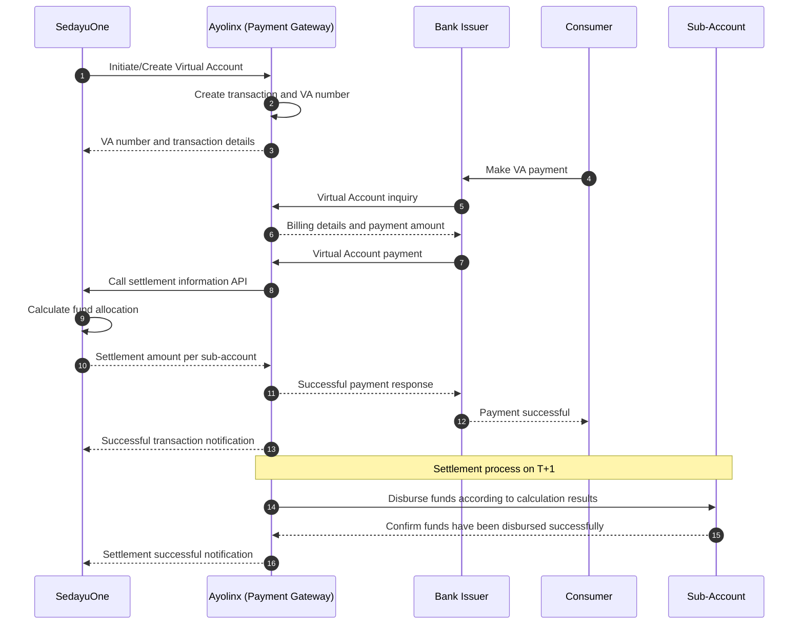

# Virtual Account Payment and Settlement Sequence Diagram

## Actors

1. **Bank Issuer** - the bank used by the Consumer to pay the Virtual Account.
2. **Ayolinx** - the Payment Gateway and Virtual Account transaction manager.
3. **SedayuOne** - the system that initiates the Virtual Account and calculates the settlement split.
4. **Consumer** - the customer making the Virtual Account payment.
5. **Sub-Account** - the destination account for disbursement of settlement funds.

## Diagram

## Process Flow

1. SedayuOne initiates the creation of a Virtual Account to Ayolinx.
2. Ayolinx creates the transaction and Virtual Account number based on SedayuOne's request.
3. The Consumer makes a Virtual Account payment through the Bank Issuer.
4. The Bank Issuer sends an inquiry to Ayolinx to validate the Virtual Account and retrieve billing information.
5. The Bank Issuer forwards the payment to Ayolinx. Ayolinx then calls the SedayuOne API to obtain the settlement value calculated for each sub-account.
6. Ayolinx sends a successful payment response to the Bank Issuer. The Consumer receives a payment success confirmation and SedayuOne receives a transaction notification.
7. On T+1, Ayolinx disburses funds to each sub-account according to the settlement calculation result from step five.

## Notes

- The settlement calculation result should be stored together with the transaction ID as the basis for reconciliation.
- Each API request and response should have a unique reference ID to support audit and transaction tracing.
- Retry and idempotency mechanisms are required to prevent duplicate recording or fund disbursement.
- If the settlement process fails, Ayolinx needs to send a failure status to SedayuOne for follow-up.
