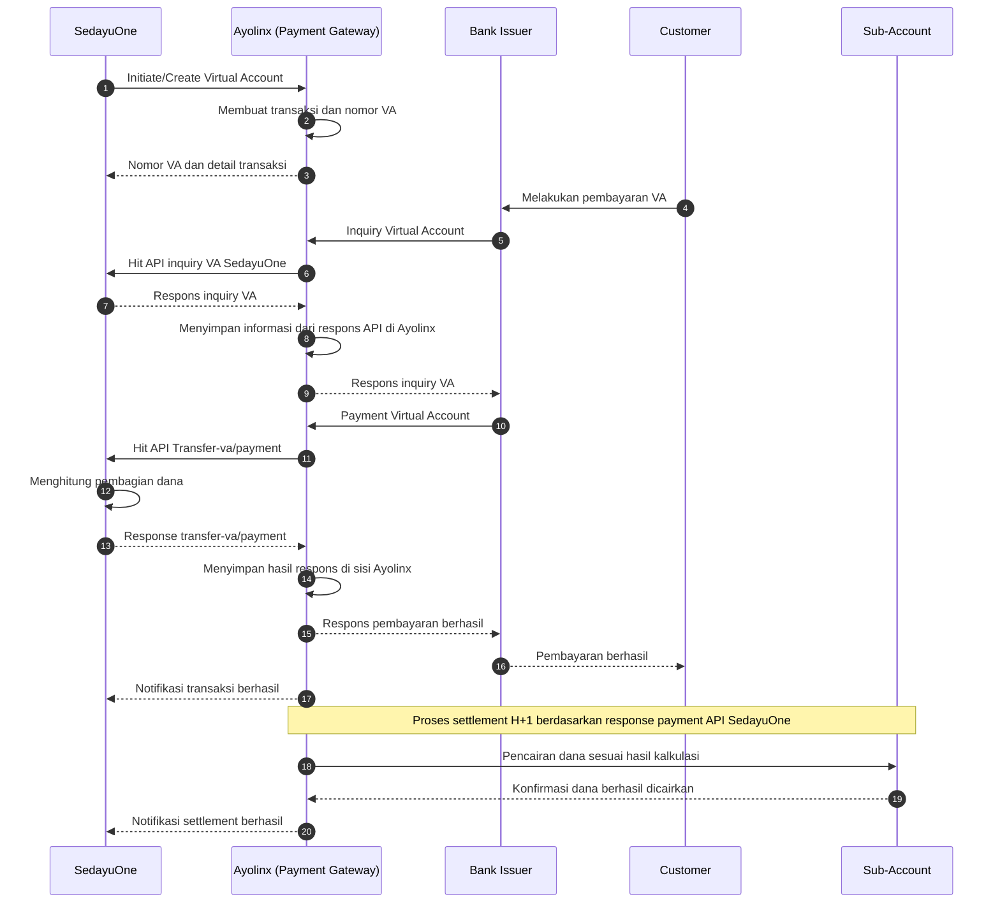

# Sequence Diagram Pembayaran Virtual Account dan Settlement

## Aktor

1. **Bank Issuer** — bank yang digunakan Consumer untuk membayar Virtual Account.
2. **Ayolinx** — Payment Gateway dan pengelola transaksi Virtual Account.
3. **SedayuOne** — sistem yang menginisiasi Virtual Account dan menghitung pembagian settlement.
4. **Customer** — pelanggan yang melakukan pembayaran Virtual Account.
5. **Sub-Account** — rekening tujuan pencairan dana hasil settlement.

## Diagram

## Urutan Proses

1. SedayuOne menginisiasi pembuatan Virtual Account ke Ayolinx.
2. Ayolinx membuat transaksi dan nomor Virtual Account berdasarkan permintaan SedayuOne.
3. Customer melakukan pembayaran Virtual Account melalui Bank Issuer.
4. Bank Issuer mengirimkan inquiry ke Ayolinx untuk memvalidasi Virtual Account dan mengambil informasi tagihan.
5. Ayolinx meneruskan inquiry tersebut ke API VA inquiry SedayuOne untuk mendapatkan konfirmasi dan detail VA.
6. Ayolinx menyimpan informasi dari respons API inquiry di sistem Ayolinx.
7. Bank Issuer meneruskan pembayaran ke Ayolinx. Ayolinx kemudian memanggil API Transfer-va/payment SedayuOne.
8. Ayolinx menyimpan hasil respons dari API Transfer-va/payment di sisi Ayolinx.
9. Ayolinx mengirimkan respons pembayaran berhasil kepada Bank Issuer. Customer menerima konfirmasi pembayaran berhasil dan SedayuOne menerima notifikasi transaksi.
10. Pada H+1, Ayolinx mentransfer dana ke masing-masing sub-account sesuai hasil hitungan pada response payment API SedayuOne dari proses kedelapan.

## Catatan

- Hasil kalkulasi settlement sebaiknya disimpan bersama ID transaksi sebagai dasar rekonsiliasi.
- Setiap permintaan dan respons API sebaiknya memiliki reference ID yang unik untuk mendukung proses audit dan pelacakan transaksi.
- Mekanisme retry dan idempotency diperlukan untuk mencegah pencatatan atau pencairan dana ganda.
- Jika proses settlement gagal, Ayolinx perlu mengirimkan status kegagalan kepada SedayuOne untuk ditindaklanjuti.
